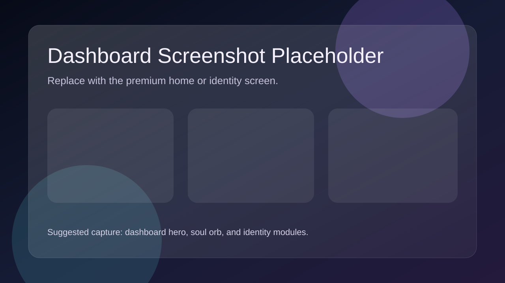
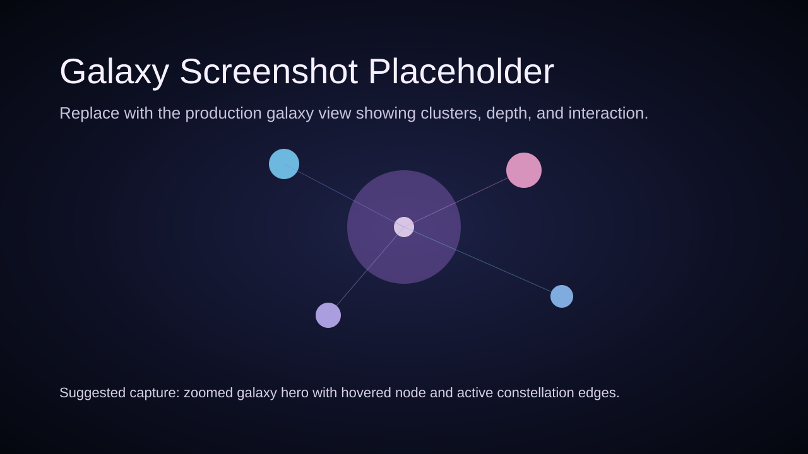
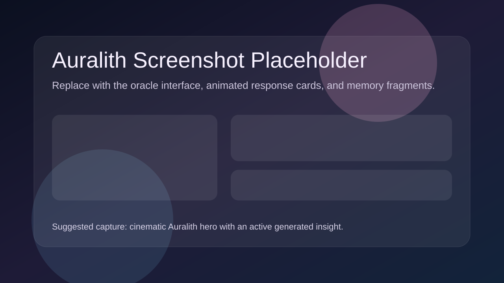

# Melody Map

**Your music, understood. Not just played.**

Melody Map is an AI-powered music identity product that turns listening history into a living portrait of taste, mood, and motion. It combines Spotify and Last.fm data, profile analytics, clustering, compatibility scoring, visual identity systems, and immersive UI to make music feel personal again.





> Replace the placeholder images above with production screenshots or GIFs before promoting the repo widely.

## Docs Index

- [Architecture](ARCHITECTURE.md)
- [ML Pipeline](ML_PIPELINE.md)
- [Deployment](DEPLOYMENT.md)
- [QA / Verification](docs/verification.md)
- [Mobile Readiness](docs/qa/mobile-readiness-checklist.md)
- [Mobile Scaffold](mobile/README.md)
- [Platform Upgrade Plan](PLATFORM_UPGRADE.md)
- [Next-Gen Migration Plan](MIGRATION_PLAN_NEXTGEN.md)

## What Melody Map Does

Melody Map treats music taste as identity data, not just playback history.

- Builds a music identity profile from Spotify and Last.fm listening data
- Computes archetypes, MBTI-style taste typing, and confidence-aware profile summaries
- Renders a premium galaxy view of artists, genres, and relationships
- Generates a living soul orb whose motion and lighting reflect audio features
- Produces curated discovery capsules, aesthetic profiles, and soulmate matching
- Includes Auralith, an AI-guided narrative layer for deeper taste interpretation

## Implemented Features

### Identity engine

- Six-archetype personality scoring based on audio features
- Music MBTI typing across four axes
- Confidence-aware profile assembly through the music profile builder
- Identity reveal and premium shell experience on the frontend

### Galaxy system

- Server-owned galaxy artifact generation and clustering pipeline
- React Three Fiber galaxy visualization with nodes, clusters, depth, and interactions
- Background recompute path for heavier galaxy builds

### Soul orb

- Audio-reactive orb motion, glow, distortion, and archetype-driven palette behavior
- MBTI and archetype-specific animation presets

### Discover and aesthetic systems

- Playlist concept generation
- Harmonic mood vector and aesthetic report generation
- Editorial recommendation presentation and atmospheric UI layers

### Social and soulmate systems

- Compatibility scoring across artists, genres, tracks, and audio features
- Public/social soulmate flows and constellation-style comparison views

### Auralith

- AI narrative layer with memory/retrieval-oriented backend support
- Dedicated route and cinematic frontend experience

### Platform hardening already in repo

- Backend-owned provider auth flow with cookie-backed bootstrap
- Security headers and safer static-file routing
- Progressive shell-first route rendering
- FastAPI/Celery/Redis/Postgres next-gen platform scaffold in `services/`

## Tech Stack

### Frontend

- React 18 + Vite
- TanStack Query
- Zustand
- Framer Motion
- React Three Fiber / Three.js
- Recharts
- D3 utilities

### Backend

- Flask production app
- FastAPI next-gen service scaffold
- MongoDB Atlas
- Redis
- Celery
- scikit-learn, NumPy, SciPy, PyTorch, FAISS

### Deployment

- Vercel frontend
- Render backend
- GitHub Actions CI

## Local Setup

### 1. Clone

```bash
git clone https://github.com/your-username/melody-map.git
cd melody-map
```

### 2. Backend

```bash
cd backend
python3.11 -m venv venv  # use Python 3.11 for the current backend stack
source venv/bin/activate  # Windows: venv\Scripts\activate
pip install -r requirements.txt
python app.py
```

Copy `.env.example` to `.env` and configure Spotify, Last.fm, MongoDB, and app secrets before running the server. The backend dependency set is currently validated in CI on Python 3.11.

### 3. Frontend

```bash
cd frontend
npm install
npm run dev
```

Create `frontend/.env` with:

```env
VITE_API_URL=http://localhost:5000
```

### 4. Verification commands

```bash
cd backend
pytest tests -q

cd ../frontend
npm test
npm run build
```

## Repo Structure

```text
melody-map/
|-- backend/                  Flask app, ML services, tests, and API routes
|-- frontend/                 React + Vite web product
|-- mobile/                   Expo mobile scaffold
|-- services/                 FastAPI, worker, and next-gen platform scaffolding
|-- docs/                     QA and verification docs
|-- ARCHITECTURE.md
|-- DEPLOYMENT.md
|-- ML_PIPELINE.md
`-- PLATFORM_UPGRADE.md
```

## What Makes It Different

- It models music taste as a structured identity signal, not a playlist preference.
- It combines analytics, ML, compatibility logic, and premium visualization in one product.
- It is moving toward a service-oriented, async, observable architecture instead of a fragile demo stack.

## Remaining Roadmap

- Replace placeholder screenshots/GIFs with polished captures
- Complete the live FastAPI route migration beyond the current scaffolded route families
- Expand async enrichment and job visibility across more ML workflows
- Continue mobile productization beyond the current scaffold

## Author

Built with obsession for music, data, visual systems, and emotional software.
